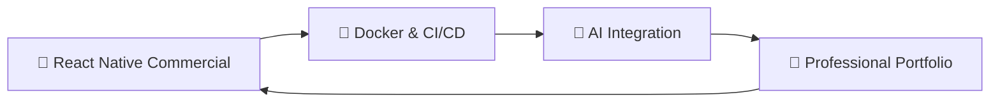

<div align="center">

# 🌟 **Hồ Dương Quốc Huy** 🌟
### 🚀 *Full Stack Developer | Mobile App | AI Learner*


<br/>

```ascii
╔══════════════════════════════════════════════════════════════════╗
║   "Building real products and improving myself every single day" ║
╚══════════════════════════════════════════════════════════════════╝
```

[](https://github.com/HoDuongQuocHuy278)
[](https://gitlab.com/huyho2782005)
[](mailto:huyho2782005@gmail.com)


</div>

---

## 🎓 **About Me**

<table>
<tr>
<td width="50%">

### 🏆 **Achievements**
- 🌟 **Full Stack Developer** - Web & Mobile Applications
- 🚀 **Product Creator** - Second-hand Trading Platform, Store App
- 🧠 **AI Enthusiast** - Integrating AI into real-world apps

### 🎯 **Current Focus**
- 💻 **Complete System Development** (Web/App)
- 💳 **Real-world Solutions** (Payments, Booking, Data)
- 🤖 **AI Integration**

</td>
<td width="50%">

### 🔥 **Quick Facts**
```yaml
name: "Ho Duong Quoc Huy"
role: "Full Stack Developer"
location: "Da Nang, Viet Nam"
age: 20
skills: ["Web App", "Mobile App", "Backend", "AI basics"]
learning: ["React Native", "Laravel", "Java", "PostgreSQL"]
motto: "Code to create value"
```

</td>
</tr>
</table>

---

## 🛠️ **Technology Arsenal**

<div align="center">

### **Frontend Mastery**


### **Backend Excellence**


### **Database Management**


</div>

---

## 🏆 **Featured Projects**

<div align="center">

### 🛍️ **Second-hand Goods Trading Platform**
**Laravel + Vue + MySQL**

<a href="https://github.com/HoDuongQuocHuy278/Shopee">
  
</a>

</div>

<table>
<tr>
<td width="50%">

#### 🌟 **Key Features**
- 🛒 **E-commerce Core** - Product listing, Cart, Reviews
- 💬 **Real-time Chat** - Buyer-Seller communication
- 💳 **VNPay Integration** - Secure online payments
- 👑 **Admin Dashboard** - System management

</td>
<td width="50%">

#### 🛠️ **Tech Stack**
- **Frontend**: Vue.js
- **Backend**: Laravel Framework
- **Database**: MySQL
- **Payment**: VNPay Gateway

</td>
</tr>
</table>

---

<div align="center">

### 📱 **React Native Store App**
**Mobile Commerce Solution**

<a href="https://github.com/HoDuongQuocHuy278/React_Native_Store">
  
</a>

</div>

<table>
<tr>
<td width="50%">

#### 🎯 **Mission**
A complete mobile shopping experience with store management capabilities.

#### 🔧 **Technologies**
- **Mobile**: React Native
- **API**: Laravel Backend
- **Networking**: Axios
- **Media**: Image Upload Handling

</td>
<td width="50%">

#### ⚡ **Features**
- 🔐 **Auth System** - Login/Register
- 🏪 **Store Management** - Manage products & shop
- 📸 **Media Upload** - Product images
- 💸 **Checkout Flow** - Seamless payments

</td>
</tr>
</table>

---

<div align="center">

### 🏸 **Badminton Court Management**
**Java Swing Desktop App**

</div>

<table>
<tr>
<td width="50%">

#### 🎨 **System Design**
- Desktop-based management interface
- Visual slot booking system
- Revenue calculation engine

</td>
<td width="50%">

#### 💻 **Technical Skills**
- **Language**: Java
- **UI**: Swing
- **DB**: MySQL
- **Logic**: OOP Principles

</td>
</tr>
</table>

---

## 📊 **GitHub Analytics**

<div align="center">


</div>

---

## 🌟 **What's Next?**

<div align="center">



</div>

- 🚀 **Commercialize** React Native Projects
- 🐳 **Master DevOps** with Docker & CI/CD
- 🧠 **AI-Powered Commerce**
- 💼 **Professional Growth**

---

## 📬 **Let's Connect!**

<div align="center">

<table>
<tr>
<td align="center">
<a href="mailto:huyho2782005@gmail.com">

</a>
</td>
<td align="center">
<a href="https://github.com/HoDuongQuocHuy278">

</a>
</td>
<td align="center">
<a href="https://gitlab.com/huyho2782005">

</a>
</td>
</tr>
</table>

### **💬 Open for collaboration on:**
- 🌏 Web Applications
- 📱 Mobile Apps
- 🤖 AI Integration

</div>

---

<div align="center">

### 🎯 **"Build product, build value."**


⭐️ **Thank you for visiting my profile!** ⭐️
**[Ho Duong Quoc Huy](https://github.com/HoDuongQuocHuy278) | Building real products every day**

</div>
